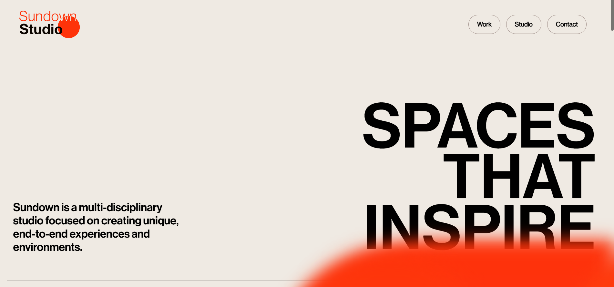
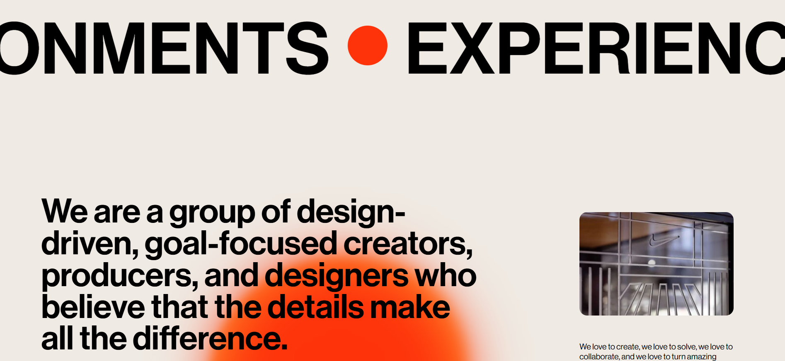
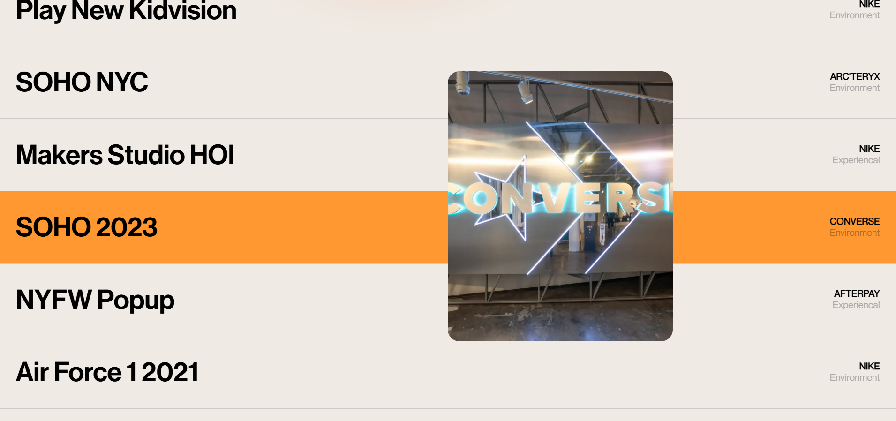
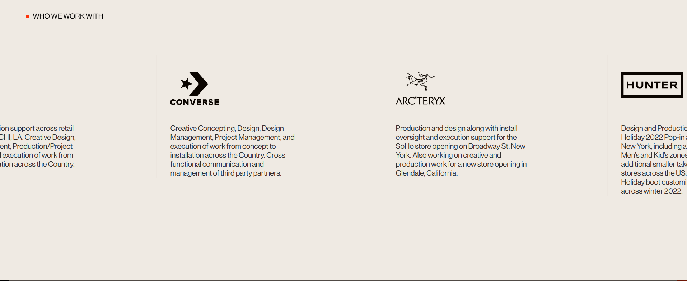

# Sundown-Studio-Website-clone

## 📌 Overview

This project is a front-end clone of the Sundown Studio website.
It was built to apply theoretical knowledge to real-world UI design and to gain a better understanding of code structure and flow.

## 🛠️ Tech Stack
  1. HTML
  2. CSS
  3. JavaScript
  4. Swiper.js
  5. Locomotive Scroll

## 🚀 Features

  1. Smooth scrolling effects using Locomotive Scroll
  2. Interactive UI elements and animations
  3. Slider implementation using Swiper.js
  4. Clean and structured layout inspired by the original website

## ⚠️ Note

  1. This project is currently not fully responsive
  2. Developed mainly for learning and practice purposes
  3. Some animations and layouts are simplified compared to the original website
     
## 💻 How to Run 

  1. Clone the repository:
   ```bash
   git clone https://github.com/SumanTiwari234/Sundown-Studio-Website-clone.git
  2. Open the project folder
  3. Open index.html in your browser

## 📸 Screenshots







